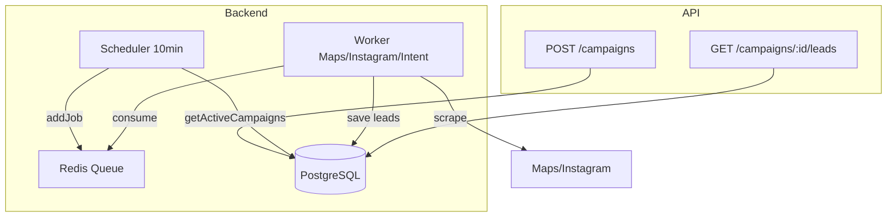

# Documentação da API Mailobot

Guia completo para aproveitar ao máximo a API de descoberta de leads.

## Visão Geral

- **Base URL:** `http://localhost:3000` (ou valor configurado em `PORT`)
- **Formato:** JSON
- **Endpoint de saúde:** `GET /health` — retorna `{ "status": "ok", "service": "mailobot" }`

## Autenticação

Todas as rotas de campanhas exigem autenticação. Use um dos métodos:

**Header (recomendado):**
```
X-Api-Key: your-secret-api-key
```

**Query string:**
```
?api_key=your-secret-api-key
```

O valor deve corresponder à variável `API_KEY` no `.env`.

### Exemplos

**cURL:**
```bash
curl -X POST http://localhost:3000/campaigns \
  -H "Content-Type: application/json" \
  -H "X-Api-Key: your-secret-api-key" \
  -d '{"user_id":1,"nome":"Minha Campanha","tipo":"NEGOCIO_LOCAL","data_de_inicio":"2025-03-01","data_de_termino":"2025-03-31"}'
```

**JavaScript (fetch):**
```javascript
const response = await fetch('http://localhost:3000/campaigns', {
  method: 'POST',
  headers: {
    'Content-Type': 'application/json',
    'X-Api-Key': 'your-secret-api-key',
  },
  body: JSON.stringify({
    user_id: 1,
    nome: 'Minha Campanha',
    tipo: 'NEGOCIO_LOCAL',
    data_de_inicio: '2025-03-01',
    data_de_termino: '2025-03-31',
  }),
});
```

---

## Referência dos Endpoints

| Método | Endpoint | Descrição |
|--------|----------|-----------|
| POST | /campaigns | Criar campanha |
| GET | /campaigns | Listar campanhas |
| GET | /campaigns/:id | Detalhes da campanha |
| PATCH | /campaigns/:id | Atualizar campanha |
| GET | /campaigns/:id/leads | Listar leads da campanha |

### POST /campaigns — Criar campanha

Cria uma nova campanha. O scheduler passará a processá-la automaticamente.

**Body (JSON):**

| Campo | Tipo | Obrigatório | Descrição |
|-------|------|-------------|-----------|
| user_id | number | Sim | Identificador do usuário |
| nome | string | Sim | Nome da campanha |
| tipo | string | Sim | `NEGOCIO_LOCAL`, `DESCOBERTA_NO_INSTAGRAM` ou `INTENCAO_DE_COMPRA` |
| data_de_inicio | string | Sim | Data de início (YYYY-MM-DD) |
| data_de_termino | string | Sim | Data de término (YYYY-MM-DD) |
| cidade_alvo | string | Não | Cidade alvo (recomendado para NEGOCIO_LOCAL) |
| palavras_chave | array | Não | Array de strings, ex: `["barbearia", "barbeiro"]` |
| seguidores_minimos | number | Não | Mínimo de seguidores no Instagram (default: 0) |
| meta_de_leads_diarios | number | Não | Meta diária de leads (default: 10, max: 1000) |

**Resposta 201:**
```json
{
  "id": 1,
  "user_id": 1,
  "nome": "Barbeiros Niterói",
  "tipo": "NEGOCIO_LOCAL",
  "cidade_alvo": "Niterói",
  "palavras_chave": ["barbearia", "barbeiro"],
  "seguidores_minimos": 1500,
  "meta_de_leads_diarios": 10,
  "data_de_inicio": "2025-03-01",
  "data_de_termino": "2025-03-31",
  "status": "ativo",
  "criado_em": "2025-03-11T12:00:00.000Z"
}
```

### GET /campaigns — Listar campanhas

Lista campanhas com filtros opcionais.

**Query params:**

| Parâmetro | Tipo | Descrição |
|-----------|------|-----------|
| user_id | number | Filtrar por usuário |
| status | string | `ativo`, `pausado` ou `encerrado` |
| tipo | string | Tipo da campanha |

**Exemplo:** `GET /campaigns?user_id=1&status=ativo`

**Resposta 200:** Array de campanhas.

### GET /campaigns/:id — Detalhes da campanha

Retorna os detalhes de uma campanha específica.

**Resposta 200:** Objeto da campanha.

**Resposta 404:** `{ "error": "Campaign not found" }`

### PATCH /campaigns/:id — Atualizar campanha

Atualiza campos da campanha. Envie apenas os campos que deseja alterar.

**Campos permitidos:** `nome`, `tipo`, `cidade_alvo`, `palavras_chave`, `seguidores_minimos`, `meta_de_leads_diarios`, `data_de_inicio`, `data_de_termino`, `status`

**Exemplo — pausar campanha:**
```json
PATCH /campaigns/1
{ "status": "pausado" }
```

**Exemplo — alterar meta:**
```json
PATCH /campaigns/1
{ "meta_de_leads_diarios": 25 }
```

### GET /campaigns/:id/leads — Listar leads

Lista os leads descobertos para a campanha, ordenados por data (mais recentes primeiro).

**Query params:**

| Parâmetro | Tipo | Default | Descrição |
|-----------|------|---------|-----------|
| limit | number | 100 | Quantidade máxima de leads (máx: 500) |

**Exemplo:** `GET /campaigns/1/leads?limit=50`

**Resposta 200:** Array de leads.

---

## Modelo de Dados

### Campanha

| Campo | Tipo | Descrição |
|-------|------|-----------|
| id | number | ID gerado automaticamente |
| user_id | number | ID do usuário |
| nome | string | Nome da campanha |
| tipo | string | Tipo da campanha |
| cidade_alvo | string \| null | Cidade alvo |
| palavras_chave | array | Array de palavras-chave |
| seguidores_minimos | number | Filtro mínimo de seguidores |
| meta_de_leads_diarios | number | Meta diária de leads |
| data_de_inicio | string | Data de início |
| data_de_termino | string | Data de término |
| status | string | `ativo`, `pausado`, `encerrado` |
| criado_em | string | Data de criação (ISO 8601) |

### Lead

| Campo | Tipo | Descrição |
|-------|------|-----------|
| id | number | ID do lead |
| campaign_id | number | ID da campanha |
| nome | string \| null | Nome do lead |
| telefone | string \| null | Telefone (extraído do WhatsApp quando disponível) |
| instagram | string \| null | Handle do Instagram |
| email | string \| null | E-mail |
| seguidores | number | Quantidade de seguidores no Instagram |
| cidade | string \| null | Cidade |
| origem | string | `google_maps`, `instagram` ou `intencao_compra` |
| pontuacao | number | Pontuação de intenção (0-100, usado em INTENCAO_DE_COMPRA) |
| status | string | `novo`, `qualificado`, `contatado`, `convertido`, `descartado` |
| criado_em | string | Data de criação (ISO 8601) |

---

## Guia de Melhores Práticas por Tipo de Campanha

### NEGOCIO_LOCAL (B2B — Google Maps + Instagram)

Ideal para encontrar negócios locais (barbearias, restaurantes, academias, etc.).

- **Obrigatório:** `cidade_alvo` — sem ele a busca no Google Maps não funciona bem.
- **Recomendado:** `palavras_chave` — termos de negócio (ex: `["barbearia", "barbeiro"]`, `["restaurante", "pizzaria"]`).
- **Qualificação:** Leads só são salvos se tiverem **link de WhatsApp na bio** do Instagram.
- **Dica:** Use `seguidores_minimos` entre 1000 e 3000 para filtrar negócios muito pequenos e aumentar a chance de resposta.
- **Origem dos leads:** `google_maps` — telefone extraído da bio quando disponível.

**Exemplo otimizado:**
```json
{
  "user_id": 1,
  "nome": "Barbeiros Niterói",
  "tipo": "NEGOCIO_LOCAL",
  "cidade_alvo": "Niterói",
  "palavras_chave": ["barbearia", "barbeiro", "cabeleireiro"],
  "seguidores_minimos": 1500,
  "meta_de_leads_diarios": 15,
  "data_de_inicio": "2025-03-01",
  "data_de_termino": "2025-03-31"
}
```

### DESCOBERTA_NO_INSTAGRAM (busca por hashtags)

Encontra perfis que postam com determinadas hashtags.

- **Recomendado:** `palavras_chave` — viram hashtags automaticamente (com ou sem `#`).
- **Opcional:** `cidade_alvo` — usado como contexto no lead.
- **Dica:** Hashtags mais específicas (ex: `#barbearianiteroi`) reduzem volume mas aumentam relevância.
- **Origem:** `instagram` — telefone quando há WhatsApp na bio.

**Exemplo otimizado:**
```json
{
  "user_id": 1,
  "nome": "Influenciadores Fitness",
  "tipo": "DESCOBERTA_NO_INSTAGRAM",
  "palavras_chave": ["academia", "treino", "fitness"],
  "cidade_alvo": "Rio de Janeiro",
  "seguidores_minimos": 5000,
  "meta_de_leads_diarios": 20,
  "data_de_inicio": "2025-03-01",
  "data_de_termino": "2025-03-31"
}
```

### INTENCAO_DE_COMPRA (usuários engajados em posts)

Encontra usuários que comentam em posts de determinadas hashtags — sinal de interesse.

- **Recomendado:** `palavras_chave` — hashtags de nicho (ex: `["queroemagrecer", "comprarcarro"]`).
- **Qualificação:** Pontuação mínima 20 (baseada em comentários/curtidas).
- **Atenção:** Leads podem **não ter telefone** — apenas Instagram; ideal para remarketing e campanhas no próprio Instagram.
- **Origem:** `intencao_compra`.

**Exemplo otimizado:**
```json
{
  "user_id": 1,
  "nome": "Interesse em Imóveis",
  "tipo": "INTENCAO_DE_COMPRA",
  "palavras_chave": ["comprarapartamento", "imovelrj", "financiamento"],
  "meta_de_leads_diarios": 30,
  "data_de_inicio": "2025-03-01",
  "data_de_termino": "2025-03-31"
}
```

---

## Comportamento do Sistema



- **Scheduler:** Roda a cada 10 minutos; processa apenas campanhas com `status = 'ativo'` e dentro do período (`data_de_inicio` ≤ hoje ≤ `data_de_termino`).
- **Limite por job:** Máximo 20 leads por execução. O scheduler usa `Math.min(deficit, 20)`.
- **Desduplicação:** Leads com mesmo telefone, Instagram ou email não são salvos (evita duplicatas entre campanhas).
- **Requisito mínimo:** Lead precisa ter ao menos um de: telefone, Instagram ou email.

---

## Exemplos Completos

### Criar campanha B2B (barbeiros)

```bash
curl -X POST http://localhost:3000/campaigns \
  -H "Content-Type: application/json" \
  -H "X-Api-Key: sua-api-key" \
  -d '{
    "user_id": 1,
    "nome": "Barbeiros Niterói",
    "tipo": "NEGOCIO_LOCAL",
    "cidade_alvo": "Niterói",
    "palavras_chave": ["barbearia", "barbeiro"],
    "seguidores_minimos": 1500,
    "meta_de_leads_diarios": 10,
    "data_de_inicio": "2025-03-01",
    "data_de_termino": "2025-03-31"
  }'
```

### Criar campanha B2C (intenção de compra)

```bash
curl -X POST http://localhost:3000/campaigns \
  -H "Content-Type: application/json" \
  -H "X-Api-Key: sua-api-key" \
  -d '{
    "user_id": 1,
    "nome": "Interesse em Carros",
    "tipo": "INTENCAO_DE_COMPRA",
    "palavras_chave": ["comprarcarro", "financiamento"],
    "meta_de_leads_diarios": 25,
    "data_de_inicio": "2025-03-01",
    "data_de_termino": "2025-03-31"
  }'
```

### Listar leads com limite

```bash
curl -H "X-Api-Key: sua-api-key" \
  "http://localhost:3000/campaigns/1/leads?limit=50"
```

### Pausar campanha

```bash
curl -X PATCH http://localhost:3000/campaigns/1 \
  -H "Content-Type: application/json" \
  -H "X-Api-Key: sua-api-key" \
  -d '{"status": "pausado"}'
```

### Alterar meta diária

```bash
curl -X PATCH http://localhost:3000/campaigns/1 \
  -H "Content-Type: application/json" \
  -H "X-Api-Key: sua-api-key" \
  -d '{"meta_de_leads_diarios": 25}'
```

---

## Tratamento de Erros

| Código | Descrição |
|--------|-----------|
| 400 | Validação falhou — campo obrigatório ausente, tipo inválido, datas inconsistentes ou `meta_de_leads_diarios` fora do intervalo (1-1000). Resposta inclui `details` com lista de erros. |
| 401 | Não autorizado — API key ausente ou inválida. |
| 404 | Campanha não encontrada. |
| 500 | Erro interno do servidor. |

**Exemplo de erro 400:**
```json
{
  "error": "Validation failed",
  "details": [
    "Campo obrigatório: cidade_alvo",
    "data_de_inicio deve ser anterior a data_de_termino"
  ]
}
```

---

## Dicas Finais para Melhores Leads

1. **Combine `cidade_alvo` + `palavras_chave` específicas** em NEGOCIO_LOCAL para resultados mais relevantes.
2. **Use `meta_de_leads_diarios` realista** (10–50) para evitar sobrecarga e bloqueios.
3. **Para leads com telefone:** prefira NEGOCIO_LOCAL e DESCOBERTA_NO_INSTAGRAM — ambos exigem WhatsApp na bio.
4. **Monitore leads** via `GET /campaigns/:id/leads` e ajuste filtros conforme os resultados.
5. **Pause campanhas** quando não precisar de novos leads: `PATCH /campaigns/:id` com `{"status": "pausado"}`.
6. **Teste hashtags** em DESCOBERTA_NO_INSTAGRAM e INTENCAO_DE_COMPRA — hashtags muito genéricas podem gerar volume alto com baixa qualidade.
